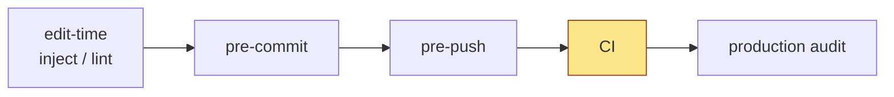
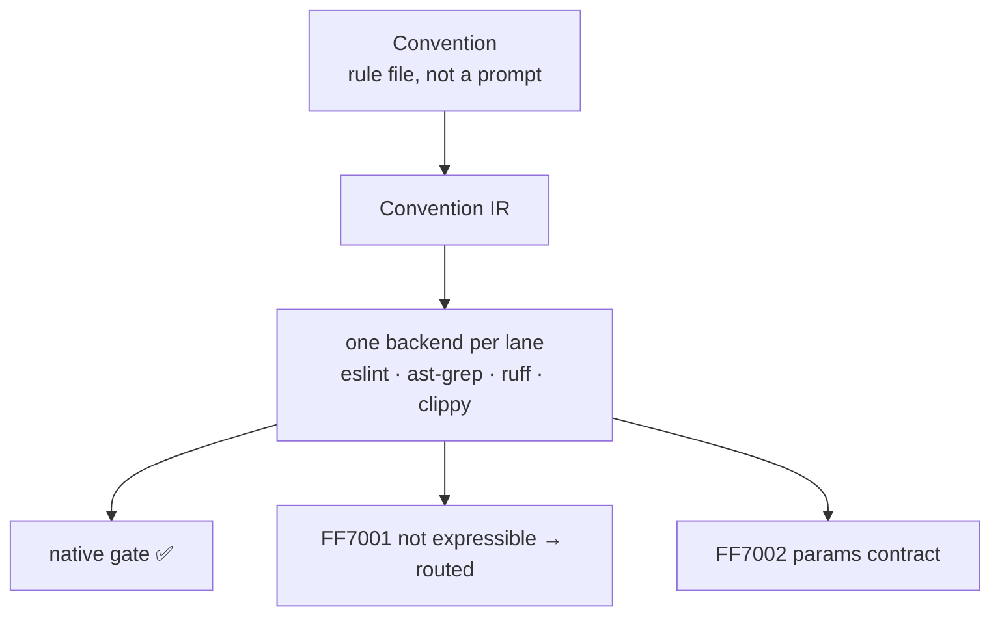
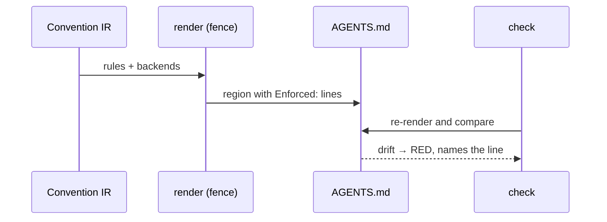

# How it works

After this page you can explain getff to a colleague with three pictures. The first
shows where a [rule](terms.md#rule) fails. The second shows how a
[convention](terms.md#convention) turns into a check your own tools run. The third
shows how getff keeps its own documentation from lying.

You do not need any of this to use getff. Read it when you want to know what you are
trusting.

## 1. Where a rule fails

A broken rule can be caught at five points. getff calls each one a
[channel](terms.md#channel).

The order is the point. The further right a rule fails, the more it costs. At edit-time
the agent sees the problem while it still has the file open. At commit time it costs
seconds. In CI it costs a push, a wait, and a context switch, and the agent that wrote
the code may be gone. So getff puts each rule at the earliest channel that can see the
problem, and treats CI as the last resort.

A rule that matters sits on more than one channel. A git hook can be skipped with one
flag. CI cannot.

## 2. From convention to native check

getff does not run your rules. Your tools do. getff's job is to turn one description of
a convention into the config each tool understands.

A convention is written once, in a neutral form the project calls the Convention IR.
A backend then tries to express it for one tool. There are three possible outcomes:

- **✅** The tool can express the rule. You get a native [gate](terms.md#gate).
- **FF7001** This tool cannot express this rule. The error says why, and which other
  tool could.
- **FF7002** The convention is missing a detail this tool needs.

The second and third outcomes matter as much as the first. A tool that cannot enforce a
rule says so. It does not pretend. This table is the real outcome today for the three
demo conventions in the getff repository:

<!-- getff:begin section=face-enforcement-outcomes plan=scripts/render-face-facts.mjs -->
| Convention | eslint | ast-grep (Python) | ruff | clippy |
|---|---|---|---|---|
| `no-direct-env-var` | FF7001 | FF7001 | FF7001 | ✅ |
| `no-direct-process-env` | ✅ | FF7002 | FF7002 | FF7001 |
| `no-datetime-now` | FF7002 | ✅ | FF7001 | FF7001 |
<!-- getff:end section=face-enforcement-outcomes -->

Read the table honestly: each demo convention is enforced by one tool out of four.
That is the state of the compile step today.

The step is already in use. The `clippy.toml` that the Rust install gives you, and the
Ruff and ast-grep configs that the Python install gives you, are written by these
backends. Each file says so in its first line. The `clippy` ✅ in the first row is the
same ban the [Rust quick start](quickstart-rust.md) [fires](terms.md#fire) on your code. The ESLint rules
for the four npm [stacks](terms.md#stack) are different: those are hand-written TypeScript.

## 3. Documentation that fails when it lies

The `AGENTS.md` in the getff repository has regions that nobody types. A program writes
them from the same conventions, and ends each rule with an `Enforced:` line built from
the outcomes in the table above.

The region sits between two marker comments, a [fence region](terms.md#fence-region).
The code in `packages/core/composition/fence.ts` owns what is inside the markers and
leaves the rest of the file alone. A test renders the region again and compares it, byte
for byte, with what is committed. If someone edits an `Enforced:` line by hand, the test
fails and prints the line.

We ran exactly that. The [Why getff](why.md#the-proof) page shows the edit, the command,
and the failing output.

## 4. The five layers

Channels say when a rule fails. Layers say what kind of rule it is. Every rule fits one
of five:

| Layer | What it checks | Typical tool |
|---|---|---|
| Architecture tests | Structure: layers, banned imports, naming, cycles. | ESLint, dependency-cruiser |
| Meta-tests | The test suite itself: every test asserts something real. | AST scans, `eslint-plugin-vitest` |
| Specification by example | Behavior, as tables of inputs and expected outputs. | Vitest `it.each`, fast-check, Zod |
| Mutation testing | Whether the tests would notice a bug. | Stryker |
| Living documentation | Whether the docs still match the code. | Test names as sentences, specs generated from schemas |

The layers guard each other. Mutation testing exists because an agent can write a test
that passes no matter what. Living documentation exists because a rules file that
nobody checks drifts away from the code.

## 5. getff runs on itself

The getff repository is held to its own rules. Its principles are tests:

<!-- getff:begin section=face-principle-count plan=scripts/render-face-facts.mjs -->
| What | Count | Where |
|---|---|---|
| Principle test files | 50 | `packages/core/principles/` |
<!-- getff:end section=face-principle-count -->

One command, `make self-audit`, runs the pre-commit checks, the pre-push checks, and
those principle tests. The same principle tests run in CI on every pull request, so a
change to getff that breaks a getff rule turns the pull request red.

This is a quality signal, not a guarantee. It shows the method survives contact with a
real, busy repository. It does not show that your conventions are the right ones.

## Honest limits

- **The compile step is young.** The table in section 2 is the whole truth: three demo
  conventions, one tool each. It writes the Rust and Python configs today. The npm
  rules are still hand-written.
- **The self-checking `AGENTS.md` regions exist in the getff repository only.** An
  install does not yet generate them for your project.
- **[Self-checks](terms.md#self-check) have edges.** [Why a rule must prove it fires](understand/why-a-rule-must-prove-it-fires.md)
  lists what the install-time checks do not catch.

Next: [Foundations](foundations.md) names the ideas getff is built on, and what was
taken from each.
