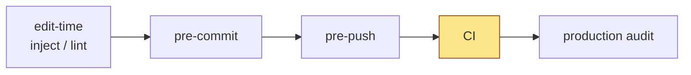
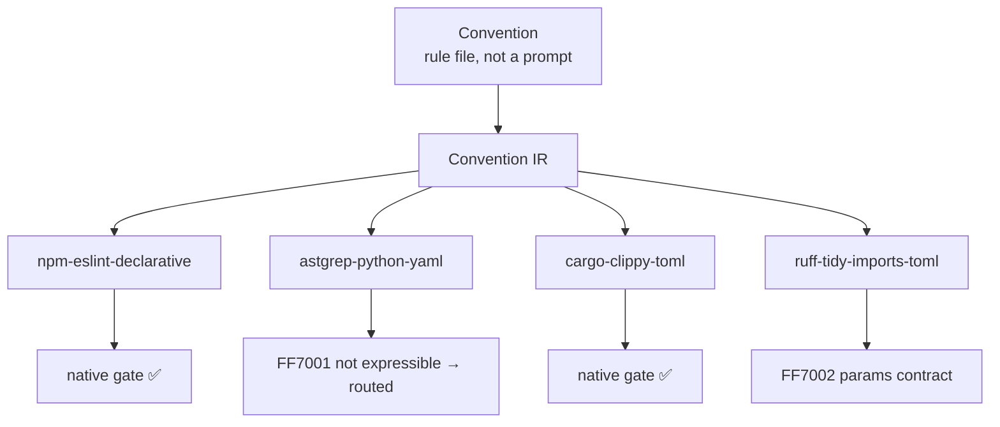
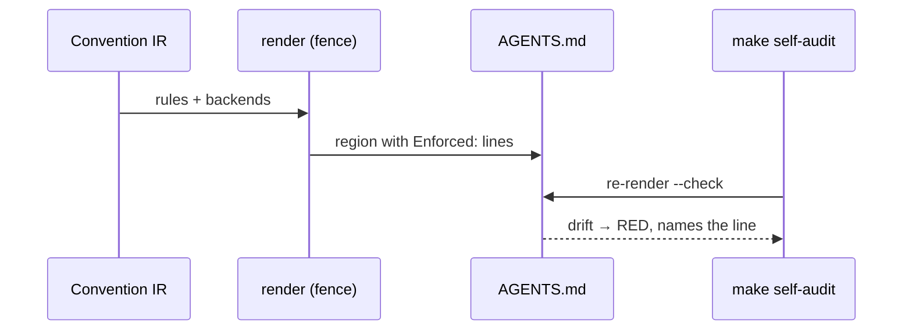

# getff.ai face pages — design spec

> **Status:** designed 2026-09-13/14 in a dedicated `/arch` §1 session (carve-out per the site umbrella's D28 / premise P-X);
> escalations E1–E4 answered by the umbrella seat 2026-09-13 (its rows D4c / D32 / D33) and folded in below;
> awaiting the two cold §2 reviews (top-down + bottom-up) in a separate Opus session (umbrella D27), then the operator's spec gate.
> **Authoritative for:** the seven face pages of the docs site, the landing hero delta, `llms.txt`, the AI-twin contract of face
> pages, the fact-supply architecture that feeds them, and the testing seams that prove each claim on them.
> **NOT authoritative for:** the site umbrella's decisions (register `_decision-register-getff-ai-site.md`, D1–D28 — binding here,
> never re-decided); the ~120 bulk pages and their five templates; brand/visual system (umbrella D7); the project goal
> ([README.md#why-this-exists](../../../README.md#why-this-exists) — never redefined by a face page).
> **Inputs (binding, read in full):** umbrella register + handoff + probes (`_probe-{askai,factcard-coverage,fumadocs-i18n}`),
> landing `main` @ `c091883`, README `§Why this exists`, `skills/getff/references/*`, prior-art SSOT, research patches, principle tests.
> **Live registers of the design session (gitignored):** `.claude/orchestrator-prompts/_decision-register-getff-ai-face-pages.md`
> (facts F1–F18, premises, decisions FD1–FD15), `_handoff-2bd1ca22-…md`, escalation `_escalation-face-pages-to-umbrella.md`
> (in the umbrella worktree).

## 0. The problem these pages solve

Two readers arrive at getff.ai with the same question and different senses. The **evaluating developer** wants to know in one
screen what getff is, whether it is honest about its maturity, and how fast a rule fires on their own code. Their **AI agent**
(Claude Code, Cursor, Codex, Aider) arrives through `llms.txt` or a `.md` twin and needs the same facts in a shape it can act on.
Today the landing sends humans to a single-stack quick start and to GitHub, sends agents to an uncurated page list, and tells
three different stories about stack maturity on three surfaces (README, `install.sh`, landing `limits.md`) — the very
«documents lie» failure the project exists to end. The face pages fix that by (a) one welcoming path per reader, (b) one source
per fact rendered everywhere, (c) every example executed and every number generated at write time.

## 1. Operator premises (verbatim-faithful; the reviews check the design against these)

- **P-X** (umbrella, inherited): the face pages are the face of the project — skills and standout features, scientific grounding,
  how it works — worked out maximally, NOT by the generic template, designed in this separate session.
- **P-F1**: both audiences — the evaluating developer AND their AI agent; AI first contact = `llms.txt` + the Introduction's twin.
- **P-F2**: no round cap; explain from the problem with evidence; honest advice, not agreement; no letter menus.
- **P-F3** (R1 answer): for the human everything must be familiar, comfortable and intuitive; every R1 recommendation accepted;
  anything touching umbrella decisions is returned to the main design session.
- **P-F4** (R1 Q6): the research grounding is a full page, longer than one screen, covering ALL of it — what the whole work stands
  on and why it is built this way and not otherwise.
- **P-F5** (R2/R3): commands and links are generated too; the project history book is a separate running effort — out of scope;
  the seat decides the fact-supply architecture itself and coordinates with the umbrella session directly.

## 2. Decision table (each with the falsifier the reviews may fire)

| # | Decision | Resolution | Falsifier |
|---|---|---|---|
| FD1 | Page set | Seven pinned pages + `/llms.txt` (§4). Ratified by the umbrella as D4c; the Understand tab LINKS to How it works / Foundations and never re-explains the same mechanism. | Group no longer fits above the sidebar fold at 1080p, or <10% of readers reach Foundations / How it works from it → both move to Understand; pinned group = 5. |
| FD2 | Human first contact | Hero CTA1 → Quick start; CTA2 → Introduction; quiet agent line under the CTAs. | Beta readers bounce on Quick start before the red gate → CTA1 → Introduction. |
| FD3 | AI first contact | Hybrid `llms.txt`: curated head + generated lists under `## Optional` (§6). | Context7 indexes twins automatically → head shrinks to H1 + blockquote + Start here. |
| FD4 | Stack status | ONE framework file `packages/core/manifest/maturity.json` (+ schema; umbrella D32), section `stacks` (this spec) beside `layers` (rules beta / factory experimental), rendered everywhere. | A hand-typed label disagrees → fence `--check` RED. Batch slips >1 week → content session renders from a stub manifest, `--check` catches the fill later. |
| FD5 | Quick start | Group page `/docs/quick-start/` (stack chooser) + four per-stack pages on the census slug family `/docs/quickstart-<stack>/`; steps from `first-steps.source.json`; every stack page ends RED on the reader's code. | A stack cannot reach RED in ≤10 min at write time → labelled «verified on fixture». Chooser bounce >30% → hero CTA1 goes straight to `quickstart-ts`. |
| FD6 | Research grounding | Own page **Foundations**, seven sections, every paragraph cites a primary artifact. | A section without a primary artifact → cut or labelled opinion. |
| FD7 | Hero | In scope structurally (§5.9); H1/brand/tokens untouched. | Operator visual sign-off rejects → structure stays, copy returns to the content session. |
| FD8 | URLs | Census URLs (umbrella B-D4, main @ 733197e) keep real content at the same slug; post-census slugs that move get static stubs (§4). | A census slug becomes a stub or a redirect → B-D4 violation, page restored. |
| FD9 | Installation axes | Route-first; depth = collapsible from the first-steps SSOT; no npm route while npm holds 0.0.1. | `setup` learns `cargo\|go` → renderer updates the page, no hand edit. |
| FD10 | Order + names | Journey order; research page = **Foundations**. | Beta readers cannot find the argument → Why getff to slot 2. |
| FD11 | Twin contract | Clean text + D8b frontmatter + `next:`; prompts only on the agent page + `llms.txt`. | Agents act from twins → one-line `agent:` pointer per twin, no duplicated prompts. |
| FD12 | Diagrams | Three diagrams on How it works as Mermaid text in the source; rendered at runtime or as SVG at build from the same text (umbrella D31 owns the dep); never hand-drawn images. | Neither render path lands in the landing conveyor → the Mermaid text ships as a fenced code block, readable as text by both audiences. |
| FD13 | Generated regions | Every number, list, command, link from the repo = fence region (§7). | A renderer restates instead of reading its runtime source → `--check` passes on a changed source = the lying-doc class. |
| FD14 | Foundations depth | Restate conclusions + link primary artifact per paragraph; history book out of scope. | — |
| FD15 | Fact supply | Approach A: one `face-facts.json` manifest (verified-at sha) feeding all fence regions (§7); rosters and counts READ from the generator session's per-family JSON, never re-derived. | Umbrella keeps doc sources in the landing → manifest is built from the framework pin, same contract. |

Rejected: four pages with «How it works» folded into Introduction (entry page becomes a long read); «How it works» as an
Understand bulk page (generic template, P-X); fully generated `llms.txt` (tree order, no priorities); `npm install getff` on
Installation (placeholder 0.0.1 on the registry); plugin-first quick start (no red gate without the opt-in command); research
grounding as a section (P-F4); one renderer per fact family (eight `verified-at` dates for seven pages); hand-written facts with a
claims audit (attention as detection, `attention-is-not-a-mechanism.md §1`).

## 3. First-contact flows

**Human.** Landing hero → «Get started» → `/docs/quick-start` (choose a stack; one card each) → `/docs/quickstart-<stack>` → red gate in ≤10 minutes → «Next: Installation»
(depth, plugin, manual) → Why getff → How it works → Foundations. The alternate entry «Read the docs» → `/docs` (Introduction),
whose first screen links Why getff and Quick start. Every page ends with one «Next» link along the journey (FD10 order).

**AI agent.** `getff.ai/llms.txt` (curated head: what getff is, honest status, «Start here» = the seven twins in journey order,
«Proof» links) → `/docs/index.md` (Introduction twin: `next:` → Quick start twin) → `/docs/ai-agents.md` (three copy-ready prompts,
Context7 + DeepWiki, what the twins carry). `llms-full.txt` stays under `## Optional` for agents that want everything.

```mermaid
flowchart LR
  H[Human: hero] -->|Get started| QS[/docs/quick-start/ chooser]
  H -->|Read the docs| I[/docs/ Introduction]
  QS --> QT1[/docs/quickstart-ts/ · -python · -rust · -go]
  QT1 --> INST[/docs/installation/] --> WHY[/docs/why/] --> HOW[/docs/how-it-works/] --> F[/docs/foundations/]
  A[Agent: llms.txt] --> IT[index.md twin] --> QT[quickstart-ts.md twin]
  A --> AG[/docs/ai-agents/ + .md]
```

## 4. Page set, order, URLs, stubs

| Order | Page | URL | Twin | Post-census slug(s) → stub |
|---|---|---|---|---|
| 1 | Introduction | `/docs/` | `/docs/index.md` | `what-is-getff` |
| 2 | Quick start (chooser) | `/docs/quick-start/` | `/docs/quick-start.md` | — |
| 2a–d | Quick start · TS/npm · Python · Rust · Go | `/docs/quickstart-ts/`, `-python/`, `-rust/`, `-go/` (new) | one twin each | — (census family kept) |
| 3 | Installation | `/docs/installation/` | `/docs/installation.md` | `first-steps-core`, `first-steps-env`, `first-steps-factory` |
| 4 | Why getff | `/docs/why/` | `/docs/why.md` | — |
| 5 | How it works | `/docs/how-it-works/` | `/docs/how-it-works.md` | — |
| 6 | Foundations | `/docs/foundations/` | `/docs/foundations.md` | — |
| 7 | Use getff with your AI agent | `/docs/ai-agents/` | `/docs/ai-agents.md` | — |
| — | `llms.txt` / `llms-full.txt` | `/llms.txt`, `/llms-full.txt` | (are the AI surface) | — |

Census URLs (umbrella B-D4 binds main @ 733197e): `/docs/quickstart-ts`, `/docs/quickstart-rust`, `/docs/executable-agents-md`,
`/docs/faq`, `/docs/limits` keep serving REAL content at the same slug — no stub, no redirect. Consequences for this spec:
the quick start is a per-stack page family (row 2a–d), `/docs/executable-agents-md/` stays the full demo page (umbrella bulk map;
How it works §3 and Why getff §proof LINK it, never duplicate it — D12), and `/docs/limits/` stays a real page whose stack table
is a fence region from `maturity.json` (same source as Introduction §4). The four post-census slugs above are listed in the D31
redirect contract as stubs. Stub contract (GitHub Pages has no server redirects, F14): a static page at the old slug carrying
`<meta http-equiv="refresh" content="0; url=<new>">`, `<link rel="canonical" href="<new>">`, `<meta name="robots" content="noindex">`,
one visible line «This page moved to <new>», excluded from the sidebar (`meta.json`) and from `llms.txt`. The other post-census
slugs (`daily-cycle-*`, `factory-overview`, `degradations`, `reference`, `beta`) belong to the umbrella's bulk map.

## 5. Per-page design

Shared rules for all seven: pain → mechanism → proof → honest limit (umbrella D6) in the page's own proportion; terms as defined
in `terms.md` (umbrella D20, written as task 0; candidate terms in §8); every code block has a copy button and was executed at
write time (D13); every number, roster, command and link is a generated region (§7); no commit/lag badge on the human render,
full signal in the twin (D8b); one «Next» link at the end.

### 5.1 Introduction (`/docs/`) — the hub

Goal: in one scroll, what getff is, for whom, honest status, and where to go. Audience: the evaluating developer first; the twin
is the agent's second read after `llms.txt`.

1. **One sentence + one paragraph** — the README goal restated, not redefined: every codebase convention becomes an executable
   artifact that fails at the earliest reachable channel; CI is the last resort. Link `README.md#why-this-exists`.
2. **Who it is for** — three rows: a team whose AI agent «writes plausible code that breaks conventions»; a maintainer whose
   AGENTS.md drifts; an evaluator who wants proof before adopting. Each row links its page (Why / How it works / Quick start).
3. **What you get today** — generated roster: skills, agents, rules, hooks, stacks/lanes, install depths, with counts from the
   manifest. One line per family with a link to its Reference family page.
4. **Honest status** — generated table from `maturity.json` `stacks`: lane · label (beta/alpha) · what the label means · rule
   generation status · verified-at. Beta = one-command install + a rule provably fires on YOUR code + live-doc rule generation;
   alpha = installs + fires on verified fixtures, generation partial or deferred (go: DEFERRED, not «by design»).
5. **Where next** — Quick start (10 minutes), Installation, Why getff; and one line for agents: `getff.ai/llms.txt`.
   Example executed at write time: none beyond the roster/status renders (this page carries no commands).

### 5.2 Quick start (`/docs/quick-start/` + `/docs/quickstart-<stack>/`) — ten minutes to the first firing gate

Goal: the reader sees a gate go RED on their own code. Audience: developer with a repo open. The chooser page carries four
cards (**TypeScript / npm** · **Python** · **Rust** · **Go**, labels from `maturity.json`), one paragraph «what happens in
the next ten minutes», nothing else. Each stack page opens with a stack-switcher row (links to its three siblings), then the
steps rendered from `first-steps.source.json` (`core` sequence: `install` → `verify-payload` → `fill-passport` →
`prove-rules-not-inert` → `watch-a-rule-fire` → `run-the-gate`), commands from the manifest (`./setup <stack>` for all four
once the source-holes batch lands `setup cargo|go`, E3; until then `bash install.sh cargo|go` is what the manifest carries).

Per stack page the executed example is the RED step: npm → `npm run check:fences-fire` (`scripts/check-fences-fire.sh`, delivered by
`setup.d/40-configs.sh:51`) after planting `as any`; lanes → the installer's own firing self-check (`setup.d/45|46|47`,
«✓ getff self-check: … fired RED on a planted violation and stayed GREEN on the clean control») followed by one planted
violation in the reader's tree and the lane's native gate (ruff/ast-grep, `cargo clippy`, `golangci-lint run`). The content
session records each stack's real output (fixture repo, date, versions) in the page's twin frontmatter `executed:` list.
Honest limit block: what a beta/alpha label means for THIS stack (from `maturity.json`). Next: Installation.

### 5.3 Installation (`/docs/installation/`) — routes × lanes × depth

Goal: every way in, honestly ordered. Sections: **One command** (recommended; `./setup <stack>` with `--yes`, `--dry-run`,
`--profile`, the lane commands; what the four steps do) → **Claude Code plugin** (`/plugin marketplace add artyhoo/getff`,
`/plugin install getff@getff`; soft layer only; `/getff:install-enforcement` = the explicit hard-layer opt-in; other harnesses via
`.opencode/INSTALL.md`) → **Manual** (`install.sh` flags, Path B/C from README) → **What gets installed** (collapsible per depth
core / env / factory from the first-steps SSOT; factory collapsed, badge from `maturity.json` `layers`) → **Updating** (`--refresh` semantics,
`copy_safe` vs `refresh_safe`, the `<file>.override.md` escape). No npm section while the registry holds 0.0.1 (F6); when 0.1.0
publishes, the manifest gains `npm.version` and the renderer adds the section. Executed examples: `./setup --dry-run ts-server`
output (trimmed), `/getff:install-enforcement` dry-run transcript. Next: Why getff.

### 5.4 Why getff (`/docs/why/`) — the argument

Goal: pain → mechanism → proof → honest limit, at project level, in one page. Sections: **The pain** (three landing items,
expanded: prose rules are parsed, not enforced — cite the AGENTS.md spec line the landing quotes; `as any` creeps back; LLM
tests are often tautological — cite the reference doc); **The mechanism** (one paragraph + link to How it works; the channel
chain; «no LLM in the loop, $0 in CI — enforced by a test» with the test path from the manifest); **The proof** (one live
`Enforced:` line quoted from the demo region + link to `/docs/executable-agents-md/` for the full demo; `make self-audit` on the
repo itself; counts: principle tests, SSOT rows, research patches, specs, claims-ledger rows — all generated); **Honest limits**
(executable AGENTS.md today = this repo's own; stack labels from `maturity.json`; source-available FSL-1.1-ALv2 → Apache-2.0
after two years; link `/docs/limits/`); **What this stands on** — one
paragraph pointing to Foundations. Executed example: `make self-audit` green, then one flipped `Enforced:` line → red, with the
gate naming the line (the landing's 90-second demo, run fresh). Next: How it works.

### 5.5 How it works (`/docs/how-it-works/`) — mechanism level

Goal: the reader can explain getff to a colleague with three pictures. Sections + diagrams (Mermaid text; render path per FD12):

1. **Where a rule fails** — the channel chain; CI last.



2. **From convention to native gate** — the compile pipeline with honest outcomes.



3. **The executable AGENTS.md** — a demo region is rendered from Convention IR and every rule line carries `Enforced:` derived
   from live render outcomes (`AGENTS.md` «Configuration access» region: FF7001 / FF7002 / ✅ per backend). Text: the fence engine
   (`packages/core/composition/fence.ts`) writes the region, `make self-audit` proves it, a flipped line goes red. The full
   demo lives at `/docs/executable-agents-md/` (census page, umbrella-owned) — this section links it and shows one line.



4. **Layers** — the five layers (fitness functions, meta-tests, spec-by-example, mutation, living docs) as a compact table
   linking the Understand pages. 5. **Recursive self-application** — the framework runs its own gates (`make self-audit`; 47
   principle tests as of write time — generated). Executed examples: the demo region diff after a flipped line; `make self-audit`
   output. Honest limit: which backends route FF7001/FF7002 today (generated from the same outcomes). Next: Foundations.

### 5.6 Foundations (`/docs/foundations/`) — what getff stands on, and why it is built this way

Goal (P-F4): the research grounding as a first-class page, longer than one screen, every paragraph restating a conclusion AND
linking its primary artifact. Sections:

1. **The thesis and where it came from** — «documents lie, tests don't»; «presets rot, principles don't» (`PROPOSAL.md`, frozen);
   the goal statement (README) and why «CI last» follows from it.
2. **Lineage** — the nine named sources (README «Inspirations & sources»): Rules-as-Tests five layers; Adzic, Specification by
   Example (L3); Martraire, Living Documentation (L5); Robinson, Consumer-Driven Contracts / Pact; Smith, shift-left (2001);
   Majors, observability 2.0; Rašić, two-AI review (`review-sidecar`); ai-docs drift practice; negative pairs as lightweight
   mutation. Each: what was taken, what was changed, link to `skills/getff/references/*.md` where the citation lives.
3. **Why AI agents specifically** — own measurements first: the instruction-compliance pilot (266 sessions / 1537 claim-turns;
   H0 «salience ≠ forcing» not rejected; detector recall/precision findings) → hence `attention-is-not-a-mechanism`; context
   degradation calibration; defer-reflex detection; the AI-laziness trap catalogue (T1–T21) as the operational form. Then the
   external literature the patches cite (45 academic sources across 24 files — generated count + reading list link).
4. **How the project keeps itself honest** — recursive self-application (`self-application.md`, GCC-bootstrap precedent as
   quality signal, not goal); build-vs-reuse SSOT (rows generated) with `Prior-art:` trailers enforced at pre-push; research
   patches as the gap accumulator (count generated); principle tests (count generated); the claims ledger on the site itself.
5. **Why so and not otherwise** — each design choice as decision · rejected alternative · evidence link: deterministic gates,
   no paid LLM in CI (`no-paid-llm-in-ci.md`, enforced by a test); earliest reachable channel (`rule-enforcement-channel-selection.md`);
   native toolchains, no custom runtime (`build-first-reuse-default.md`); executable docs over prose (`doc-authority-hierarchy.md`);
   source-available license (README «License»); one fact one place (this spec §7).
6. **What is measured and what is not** — honest: pilots are N-small and eval-aware; «useful on a live project» is an unmeasured
   axis (operator, 2026-09-09); stack labels follow field experience, not the fixture matrix.
7. **Reading list** — SSOT, research-patches index, principle catalogue, specs index, the shipped references. (The project history
   book is a separate effort and is not linked until it ships — P-F5.)
Executed examples: none (no commands); every count is a generated region. Next: Use getff with your AI agent.

### 5.7 Use getff with your AI agent (`/docs/ai-agents/`)

Goal: the human hands the site to their agent in one paste; the agent lands on a page written for it. Sections: **Give your
agent the site** — `getff.ai/llms.txt` (copy), what it contains, `llms-full.txt` for everything; **Three prompts** (copy-ready,
executed at write time in Claude Code and recorded): «Evaluate getff for this repo» (reads Introduction + Why + status), «Install
getff here» (the quick-start page for the detected stack, stops before the hard layer unless told), «Explain a rule that just fired»
(reads the Reference family page from the twin's `next:`/links); **Other doors** — Context7 (`artyhoo/getff`, auto-refreshed),
DeepWiki (`deepwiki.com/artyhoo/getff`, with the honest note that its index lags: state the indexed-at date measured at write
time), the in-repo plugin (`/plugin marketplace add artyhoo/getff`) and its skills (`getff`, `using-getff`, `installing-enforcement`,
`tool-bootstrapping`); **What the twins carry** — the D8b frontmatter (§6), so an agent can cite paths at a pinned sha and detect
staleness; **No MCP server** — and why (static, $0; umbrella D9). Next: back to Introduction.

### 5.8 `llms.txt` and `llms-full.txt`

Shape (llmstxt.org): `# getff` → blockquote (one honest sentence: what it does + status labels from the status source) → free
paragraph (for whom; no LLM in the loop; how the twins are pinned) → `## Start here` (the seven twins in journey order, one-line
notes; the quick-start entry lists its four stack twins indented beneath it) → `## Proof` (`AGENTS.md` permalink at verified-at, `make self-audit`, claims ledger) → `## Reference` (generated family
list) → `## Optional` (`llms-full.txt`, Understand/Guides lists, generated). The curated head is authored by the content session
and lives in a template; the generator appends the lists in the same PR (umbrella D26). `llms-full.txt` = every page's processed
markdown, unchanged mechanism, face pages first.

### 5.9 Landing hero delta (`app/(site)/page.tsx`, structural only)

- CTA1 «Get started» → `/docs/quick-start/`; CTA2 «Read the docs» → `/docs/`; the AGENTS.md link moves to §04 «Feel it».
- New quiet line under the CTAs: «Using an AI agent? Point it at getff.ai/llms.txt» + `CopyButton`.
- §03 step 3 gets «→ how it works in detail» → `/docs/how-it-works/`.
- §05 Install: two blocks — one-command first (`git clone … && bash /tmp/rt/setup ts-server`, copy), plugin second with its
  soft/hard sentence; link to `/docs/installation/`.
- §06 Honest limits: the stack line becomes a generated region from `maturity.json`; license and «executable AGENTS.md today
  = this repo's own» stay hand-written.
- Untouched: H1, eyebrow, hero terminal, videos, subscription form, tokens/theme (umbrella D7). Copy is the content session's.
Verification: `grep -nE 'four stacks|Python|Go' app/\(site\)/page.tsx` outside the fence region returns nothing; both CTAs are
internal.

## 6. AI twin contract (face pages)

Frontmatter on every face `.md` twin (D8b, extended here):

```yaml
title: Quick start
url: https://getff.ai/docs/quick-start/
verified-at: <framework sha>          # the face-facts manifest snapshot this page was rendered from
stale-since: <sha or null>            # set by the docs-refresh gate (umbrella D26) when a cited path changed
sources:                              # every path the page cites, as permalinks at verified-at
  - https://github.com/artyhoo/getff/blob/<sha>/install.sh#L281
executed:                             # examples run at write time
  - { step: run-the-gate, lane: npm, date: 2026-09-xx, result: RED }
next: /docs/installation.md
```

Body = the page text as markdown (fumadocs `getLLMText`), no agent prompts (FD11). The human render shows none of this except an
optional quiet «Updated <date>» footer. Page actions (copy markdown, open in ChatGPT/Claude) require `markdownUrl` wired in
`[[...slug]]/page.tsx` (umbrella D10 — a dependency, not decided here).

## 7. Fact-supply architecture (FD13 + FD15 — approach A)

One generator, `scripts/render-face-facts.mjs`, reads the SAME sources the runtime executes and writes
`packages/core/manifest/face-facts.json` (`verified-at: <sha>`), from which fence regions on the seven pages, `llms.txt` and the
hero §06 are filled by the existing engine (`packages/core/composition/fence.ts`; `--write/--check` precedent
`scripts/render-install-roster.mjs` — «derived, not asserted»). Families and sources:

| Family | Source read (never restated) | Consumers |
|---|---|---|
| maturity | `packages/core/manifest/maturity.json` (`stacks` + `layers`; umbrella D32, new) | Introduction, Installation, stack pages' limits, `/docs/limits/`, `llms.txt`, README, hero §06 |
| install commands | `install.sh:281` `LANE_TABLE` + `setup:63-68` stack case + README flags | Stack pages, Installation, hero §05 |
| first-steps | `packages/core/templates/shared/first-steps.source.json` | Stack pages' steps, Installation «What gets installed» |
| rosters | the generator session's per-family JSON `docs/site/reference/<family>.json` (umbrella D9/D29) — READ, never re-derived | Introduction, agent page |
| counts | family JSON where a family exists; otherwise `packages/core/principles/*.test.ts`, `prior-art-evaluations.md` rows, `research-patches/*.md`, `docs/superpowers/specs/*.md`, landing `CLAIMS-LEDGER.md` | Why getff, How it works, Foundations |
| enforcement outcomes | the AGENTS.md demo region render outcomes | How it works §3, honest-limit lines |
| links | every cited path → permalink at `verified-at` | all twins `sources:`, Proof sections |
| npm | `npm view getff version` (only when ≥ 0.1.0) | Installation npm section (absent until then) |

Routing: the generator and `maturity.json` are capability commits in the framework (Prior-art trailer, `rules-manifest.json`
precedent; consult SSOT + context7 per CLAUDE.md) → the umbrella's stage **«S0a — source-holes batch»** (provisional label,
umbrella D28a; with D14d PARTIAL-family fields and `setup cargo|go`), BEFORE the content session; the D31 rollout session may
rename it with a pointer. The framework→landing pin sync carries GENERATED content only: `face-facts.json`,
`docs/site/reference/<family>.json`, the `.md` twins, `llms.txt`. The four stub pages and the `markdownUrl` page-actions wiring
(D10) are landing-repo code owned by the cutover stage (D31 S2) — authored once, never conveyed (umbrella D28a; falsifier: a
generated artifact that needs a landing-side edit on every pin bump means the boundary is wrong — move the generator or the
config, never both). Where the umbrella decides doc sources live does not change this contract (FD15 falsifier). `--check`
runs in the framework pre-push and in the landing CI, so a hand-typed number, command or label anywhere on a face page is RED.

## 8. Terms and claims discipline

Face pages obey `terms.md` (umbrella D20, task 0). Candidate terms this spec introduces or relies on, for that file: getff ·
rule · gate · channel (edit-time / pre-commit / pre-push / CI / production audit) · lane (python / cargo / go) · stack (npm
stacks) · depth (core / env / factory) · fire / firing · self-check · soft layer / hard layer · twin (`.md`) · fence region ·
manifest · verified-at · beta / alpha (as defined in the status source). Forbidden synonyms to register: «hook» for gate,
«toolchain» for lane, «tier» for depth. Every sentence with a number, a version, a count or a status is a claim (D13) and goes
through the claims auditor; on these pages such sentences are generated, so the auditor's job reduces to prose claims.

## 9. Testing seams (what proves what)

| Seam | Mechanism | RED when |
|---|---|---|
| S1 facts | `render-face-facts.mjs --check` (framework pre-push + landing CI) | any fence region differs from the manifest render |
| S2 maturity | same, over `maturity.json` | a label typed by hand anywhere (README, pages, hero) |
| S3 examples | twin `executed:` entries + the content session's fixture logs (`EXIT=` recorded) | a stack page lacks a RED result, or result date is missing |
| S4 URLs | lychee over `out/` in the landing CI + census test: every B-D4 census URL serves a real page (no `refresh` meta) + stub test: every listed post-census slug serves `refresh` + `canonical` | a census slug stubbed, a stub missing or pointing at a 404 |
| S5 llms.txt | shape test: H1, blockquote, `## Start here` with exactly the seven twins in order (+ four stack twins under quick start), `## Optional` present | head drifts or lists are hand-edited |
| S6 twins | frontmatter schema test (fields in §6; `sources` all permalinks at `verified-at`) | a twin without `verified-at`, a relative path in `sources` |
| S7 diagrams | render smoke in the static export: each of the three diagrams yields an `<svg>` (runtime or build path) | a diagram block renders empty or as raw text |
| S8 hero | `grep` guard from §5.9 + both CTAs internal | a stack word outside the fence region |
| S9 terms | `terms.md --check` (D20) forbidden-synonym scan over the seven pages | a synonym survives |

## 10. Dependencies, order of work, escalations

1. Umbrella answers to E1–E4 (2026-09-13, register rows D4c / D32 / D33) and to the two follow-up asks (row D28a) are folded
   into FD1, FD4, FD5, FD8, FD12, §4, §7. No open dependency on the umbrella remains; D31 may rename stages with a pointer.
2. Stage S0a — source-holes batch (framework): `maturity.json` + schema, `render-face-facts.mjs`, `setup cargo|go`, D14d fields,
   hook headers + twin/baseline regen; `terms.md` task 0 (D20). Then S0b — gold pages + rules (umbrella's).
3. Cutover stage (D31 S2, landing repo): diagram render path, `markdownUrl` page actions (D10), the four stub pages; the pin sync
   brings the generated artifacts (`face-facts.json`, family JSON, twins, `llms.txt`).
4. Clean Fable content session (umbrella D24b/D25) writes the seven pages, `llms.txt` head, hero copy, from the content brief.
5. Cold reviews of THIS spec (D27, separate Opus session) run before step 4; their findings land in §11 with dispositions.

## 11. Review changelog

_(filled after the two cold rounds: finding → ACCEPTED / DISSOLVED / ESCALATED / FIXED with the section changed)_

## 12. Deliverable pointers

- Content brief for the content session: `.claude/orchestrator-prompts/_content-brief-getff-ai-face-pages.md` (gitignored, this worktree).
- Review brief for the Opus review session: `.claude/orchestrator-prompts/_review-brief-getff-ai-face-pages.md` (gitignored, this worktree).
- Design registers: `_decision-register-getff-ai-face-pages.md`, `_handoff-2bd1ca22-…md`; umbrella escalation in the umbrella worktree.
