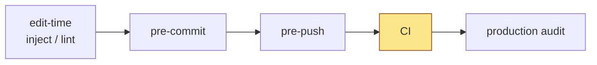
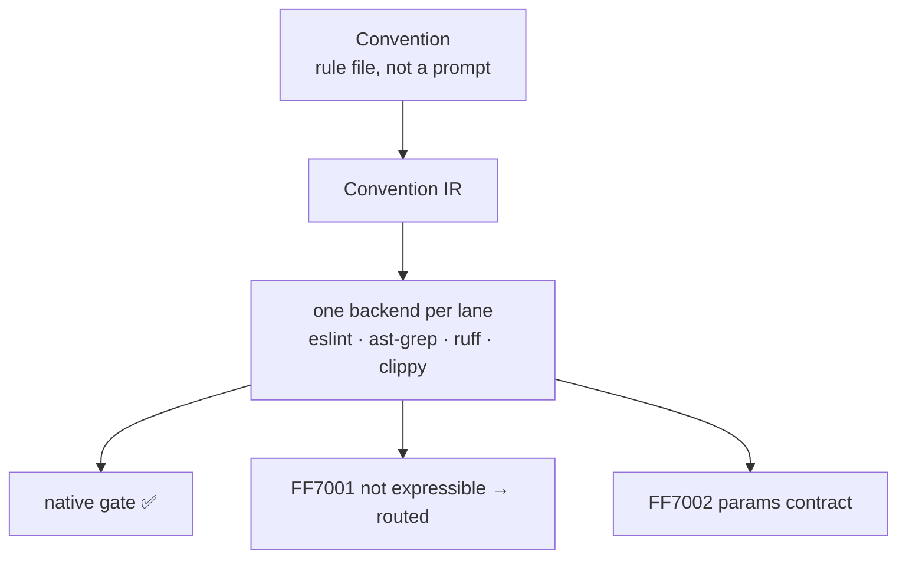
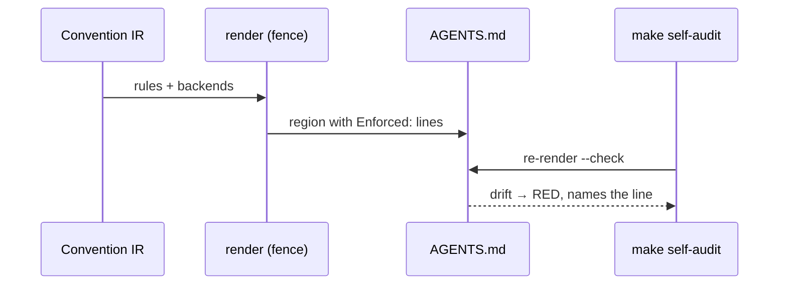

# getff.ai face pages — design spec

> **Status:** designed 2026-09-13/14 in a dedicated `/arch` §1 session (carve-out per the site umbrella's D28 / premise P-X);
> escalations E1–E4 answered by the umbrella seat 2026-09-13 (its rows D4c / D32 / D33) and folded in below;
> two cold D27 reviews (top-down + bottom-up, Opus session `upbeat-bassi-7ccdbb-ef`, 2026-09-14) returned REVISE; every finding is
> dispositioned in §11 and fixed inline; the umbrella seat confirmed no conflict (its spec `d80d4f4d9a2`, rows D28a/D36 updated);
> awaiting the operator's spec gate.
> **Authoritative for:** the eleven face pages of the docs site (the pinned seven + the four `/docs/quickstart-<stack>/` stack pages, umbrella D48 (a)), the landing hero delta, `llms.txt`, the AI-twin contract of face
> pages, the fact-supply architecture that feeds them, and the testing seams that prove each claim on them.
> **NOT authoritative for:** the site umbrella's decisions (register `_decision-register-getff-ai-site.md`, D1–D28 — binding here,
> never re-decided); the ~120 bulk pages and their five templates; brand/visual system (umbrella D7); the project goal
> ([README.md#why-this-exists](../../../README.md#why-this-exists) — never redefined by a face page).
> **Inputs (binding, read in full):** umbrella register + handoff + probes (`_probe-{askai,factcard-coverage,fumadocs-i18n}`),
> landing `main` @ `c091883`, README `§Why this exists`, `skills/getff/references/*`, prior-art SSOT, research patches, principle tests.
> **Live registers of the design session (gitignored):** `.claude/orchestrator-prompts/_decision-register-getff-ai-face-pages.md`
> (facts F1–F18, premises, decisions FD1–FD15), `_handoff-2bd1ca22-…md`, escalation `_escalation-face-pages-to-umbrella.md`
> (in the umbrella worktree).

## 0. The problem these pages solve

Two readers arrive at getff.ai with the same question and different senses. The **evaluating developer** wants to know in one
screen what getff is, whether it is honest about its maturity, and how fast a rule fires on their own code. Their **AI agent**
(Claude Code, Cursor, Codex, Aider) arrives through `llms.txt` or a `.md` twin and needs the same facts in a shape it can act on.
Today the landing sends humans to a single-stack quick start and to GitHub, sends agents to an uncurated page list, and tells
three different stories about stack maturity on three surfaces (README, `install.sh`, landing `limits.md`) — the very
«documents lie» failure the project exists to end. The face pages fix that by (a) one welcoming path per reader, (b) one source
per fact rendered everywhere, (c) every example executed and every number generated at write time.

## 1. Operator premises (verbatim-faithful; the reviews check the design against these)

- **P-X** (umbrella, inherited): the face pages are the face of the project — skills and standout features, scientific grounding,
  how it works — worked out maximally, NOT by the generic template, designed in this separate session.
- **P-F1**: both audiences — the evaluating developer AND their AI agent; AI first contact = `llms.txt` + the Introduction's twin.
- **P-F2**: no round cap; explain from the problem with evidence; honest advice, not agreement; no letter menus.
- **P-F3** (R1 answer): for the human everything must be familiar, comfortable and intuitive; every R1 recommendation accepted;
  anything touching umbrella decisions is returned to the main design session.
- **P-F4** (R1 Q6): the research grounding is a full page, longer than one screen, covering ALL of it — what the whole work stands
  on and why it is built this way and not otherwise.
- **P-F5** (R2/R3): commands and links are generated too; the project history book is a separate running effort — out of scope;
  the seat decides the fact-supply architecture itself and coordinates with the umbrella session directly.

## 2. Decision table (each with the falsifier the reviews may fire)

| # | Decision | Resolution | Falsifier |
|---|---|---|---|
| FD1 | Page set | Eleven face pages — the seven pinned (ratified by the umbrella as D4c) + the four `/docs/quickstart-<stack>/` stack pages (rows 1–2d, §4; umbrella D48 (a)) — plus `/llms.txt` (§4). The Understand tab LINKS to How it works / Foundations and never re-explains the same mechanism. | Group no longer fits above the sidebar fold at 1080p, or <10% of readers reach Foundations / How it works from it → both move to Understand; pinned group = 5. |
| FD2 | Human first contact | Hero CTA1 → Quick start; CTA2 → Introduction; quiet agent line under the CTAs. | Beta readers bounce on Quick start before the red gate → CTA1 → Introduction. |
| FD3 | AI first contact | Hybrid `llms.txt`: curated head + generated lists under `## Optional` (§6). | Context7 indexes twins automatically → head shrinks to H1 + blockquote + Start here. |
| FD4 | Stack status | ONE framework file `packages/core/manifest/maturity.json` (+ schema; umbrella D32), section `stacks` (this spec) beside `layers` (rules beta / factory experimental), rendered everywhere. One row per INSTALLABLE positional (`ts-server`, `react-next`, `react-spa`, `react-native`, `python`, `cargo`, `go`), each with label · definition · `caveat` sentence · verified-at (§5.1.4). | A hand-typed label disagrees → fence `--check` RED. Batch slips >1 week → content session renders from a stub manifest whose cells are real operator facts or the generator's absence token (umbrella D36 — never a placeholder value), `--check` catches the fill later. |
| FD5 | Quick start | Group page `/docs/quick-start/` (stack chooser) + four per-stack pages on the census slug family `/docs/quickstart-<stack>/`; all seven steps from `first-steps.source.json` plus the new SSOT step `fire-on-your-code`; every stack page ends RED on the reader's code via the stack's NATIVE gate (§5.2). | A stack cannot reach RED in ≤10 min at write time → labelled «verified on fixture». Chooser bounce >30% → hero CTA1 goes straight to `quickstart-ts`. |
| FD6 | Research grounding | Own page **Foundations**, seven sections, every paragraph cites a primary artifact. | A section without a primary artifact → cut or labelled opinion. |
| FD7 | Hero | In scope structurally (§5.9); H1/brand/tokens untouched. | Operator visual sign-off rejects → structure stays, copy returns to the content session. |
| FD8 | URLs | Census URLs (umbrella B-D4, main @ 733197e) keep real content at the same slug; post-census slugs that move get static stubs (§4). | A census slug becomes a stub or a redirect → B-D4 violation, page restored. |
| FD9 | Installation axes | Route-first; depth = collapsible from the first-steps SSOT; no npm route while npm holds 0.0.1. | `setup` learns `cargo\|go` → renderer updates the page, no hand edit. |
| FD10 | Order + names | Journey order; research page = **Foundations**. | Beta readers cannot find the argument → Why getff to slot 2. |
| FD11 | Twin contract | Clean text + D8b frontmatter + `next:`; the framework page carries `path:line` anchors, the landing build stamps `url` / `verified-at` / permalinks / `stale-since` (umbrella D34, §6); prompts only on the agent page + `llms.txt`. | Agents act from twins → one-line `agent:` pointer per twin, no duplicated prompts. |
| FD12 | Diagrams | Three diagrams on How it works as Mermaid text in the source; rendered at runtime or as SVG at build from the same text (umbrella D31 owns the dep); never hand-drawn images. | Neither render path lands in the landing conveyor → the Mermaid text ships as a fenced code block, readable as text by both audiences. |
| FD13 | Generated regions | Every number, list, command, link from the repo = fence region (§7); in S0 the content session gold-fills each region from its named source, in S1 the generator must reproduce the gold byte-for-byte (umbrella D24b). | A renderer restates instead of reading its runtime source → `--check` passes on a changed source = the lying-doc class. |
| FD14 | Foundations depth | Restate conclusions + link primary artifact per paragraph; history book out of scope. | — |
| FD15 | Fact supply | Approach A: one `face-facts.json` manifest (verified-at sha) feeding all fence regions (§7); rosters and counts READ from the generator session's per-family JSON, never re-derived. | Umbrella keeps doc sources in the landing → manifest is built from the framework pin, same contract. |

Rejected: four pages with «How it works» folded into Introduction (entry page becomes a long read); «How it works» as an
Understand bulk page (generic template, P-X); fully generated `llms.txt` (tree order, no priorities); `npm install getff` on
Installation (placeholder 0.0.1 on the registry); plugin-first quick start (no red gate without the opt-in command); research
grounding as a section (P-F4); one renderer per fact family (eight `verified-at` dates for seven pages); hand-written facts with a
claims audit (attention as detection, `attention-is-not-a-mechanism.md §1`).

## 3. First-contact flows

**Human.** Landing hero → «Get started» → `/docs/quick-start` (choose a stack; one card each) → `/docs/quickstart-<stack>` → red gate in ≤10 minutes → «Next: Installation»
(depth, plugin, manual) → Why getff → How it works → Foundations. The alternate entry «Read the docs» → `/docs` (Introduction),
whose first screen links Why getff and Quick start. Every page ends with one «Next» link along the journey (FD10 order).

**AI agent.** `getff.ai/llms.txt` (curated head: what getff is, honest status, «Start here» = the seven twins in agent order (§5.8),
«Proof» links) → `/docs/index.md` (Introduction twin: `next:` → Quick start twin) → `/docs/ai-agents.md` (three copy-ready prompts,
Context7 + DeepWiki, what the twins carry). `llms-full.txt` stays under `## Optional` for agents that want everything.

```mermaid
flowchart LR
  H[Human: hero] -->|Get started| QS[/docs/quick-start/ chooser]
  H -->|Read the docs| I[/docs/ Introduction]
  QS --> QT1[/docs/quickstart-ts/ · -python · -rust · -go]
  QT1 --> INST[/docs/installation/] --> WHY[/docs/why/] --> HOW[/docs/how-it-works/] --> F[/docs/foundations/]
  A[Agent: llms.txt] --> IT[index.md twin] --> QT[quickstart-ts.md twin]
  A --> AG[/docs/ai-agents/ + .md]
```

## 4. Page set, order, URLs, stubs

| Order | Page | URL | Twin | Post-census slug(s) → stub |
|---|---|---|---|---|
| 1 | Introduction | `/docs/` | `/docs/index.md` | `what-is-getff` |
| 2 | Quick start (chooser) | `/docs/quick-start/` | `/docs/quick-start.md` | — |
| 2a–d | Quick start · TS/npm · Python · Rust · Go | `/docs/quickstart-ts/`, `-python/`, `-rust/`, `-go/` (new) | one twin each | — (census family kept) |
| 3 | Installation | `/docs/installation/` | `/docs/installation.md` | `first-steps-core`, `first-steps-env`, `first-steps-factory` |
| 4 | Why getff | `/docs/why/` | `/docs/why.md` | — |
| 5 | How it works | `/docs/how-it-works/` | `/docs/how-it-works.md` | — |
| 6 | Foundations | `/docs/foundations/` | `/docs/foundations.md` | — |
| 7 | Use getff with your AI agent | `/docs/ai-agents/` | `/docs/ai-agents.md` | — |
| — | `llms.txt` / `llms-full.txt` | `/llms.txt`, `/llms-full.txt` | (are the AI surface) | — |

Census URLs (umbrella B-D4 binds main @ 733197e): `/docs/quickstart-ts`, `/docs/quickstart-rust`, `/docs/executable-agents-md`,
`/docs/faq`, `/docs/limits` keep serving REAL content at the same slug — no stub, no redirect. Consequences for this spec:
the quick start is a per-stack page family (row 2a–d), `/docs/executable-agents-md/` stays the full demo page (umbrella bulk map;
How it works §3 and Why getff §proof LINK it, never duplicate it — D12), and `/docs/limits/` stays a real page whose stack table
is a fence region from `maturity.json` (same source as Introduction §4). The four post-census slugs above are listed in the D31
redirect contract as stubs. Stub contract (GitHub Pages has no server redirects, F14): a static page at the old slug carrying
`<meta http-equiv="refresh" content="0; url=<new>">`, `<link rel="canonical" href="<new>">`, one visible line «This page
moved to <new>», no `noindex` (it would contradict the cross-URL canonical; shape = rollout R7 `write-redirect-stubs.mjs`),
excluded from the sidebar (`meta.json`) and from `llms.txt`. The other post-census
slugs (`daily-cycle-*`, `factory-overview`, `degradations`, `reference`, `beta`) belong to the umbrella's bulk map.

## 5. Per-page design

Shared rules for all eleven, rows 1–2d (pointer target: the umbrella's reader-comfort card, D30/D35, kind «face page», points HERE and never
copies — keep this paragraph's anchor and meaning stable): pain → mechanism → proof → honest limit (umbrella D6) in the page's own proportion; terms as defined
in `terms.md` (umbrella D20, skeleton built in S0q per D50; candidate terms in §8); every code block has a copy button and was executed at
write time (D13); every number, roster, command and link is a generated region (§7); no commit/lag badge on the human render,
full signal in the twin (D8b); one «Next» link at the end.

### 5.1 Introduction (`/docs/`) — the hub

Goal: in one scroll, what getff is, for whom, honest status, and where to go. Audience: the evaluating developer first; the twin
is the agent's second read after `llms.txt`.

1. **One sentence + one paragraph** — the README goal restated, not redefined: every codebase convention becomes an executable
   artifact that fails at the earliest reachable channel; CI is the last resort. Link `README.md#why-this-exists`.
2. **Who it is for** — three rows: a team whose AI agent «writes plausible code that breaks conventions»; a maintainer whose
   AGENTS.md drifts; an evaluator who wants proof before adopting. Each row links its page (Why / How it works / Quick start).
3. **What you get today** — generated roster: skills, agents, rules, hooks, stacks/lanes, install depths, with counts from the
   manifest. One line per family with a link to its Reference family page.
4. **Honest status** — generated table from `maturity.json` `stacks`, one row per installable positional (`ts-server`,
   `react-next`, `react-spa`, `react-native`, `python`, `cargo`, `go`): stack · label · what the label means · `caveat` (one
   sentence, e.g. react-spa «ships one rule, the pack is still growing», cargo «cargo-deny ships as a starter config, no workflow
   runs it») · rule generation status · verified-at. Beta = one-command install + a rule provably fires on YOUR code + live-doc
   rule generation; alpha = installs + fires on verified fixtures, generation partial or deferred (go: DEFERRED, not «by
   design»); early / experimental = README's own words for `react-spa` / `react-native`. The `caveat` column is the ONLY home
   of the honest-limit sentences that today disagree across README, `limits.md` and the hero — each of those surfaces renders it.
5. **Where next** — Quick start (10 minutes), Installation, Why getff; and one line for agents: `getff.ai/llms.txt`.
   Example executed at write time: none beyond the roster/status renders (this page carries no commands).

### 5.2 Quick start (`/docs/quick-start/` + `/docs/quickstart-<stack>/`) — ten minutes to the first firing gate

Goal: the reader sees a gate go RED on their own code. Audience: developer with a repo open. The chooser page carries four
cards (**TypeScript / npm** · **Python** · **Rust** · **Go**); the npm card shows its four installable stacks in-page
(`ts-server` · `react-next` · `react-spa` · `react-native`) with the label and caveat of each row from `maturity.json`, so
the label the reader sees is the label of the positional they will type; one paragraph «what happens in the next ten
minutes», nothing else. Each stack page opens with a stack-switcher row (links to its three siblings), then ALL steps of the
`core` sequence rendered from `first-steps.source.json` (`install` → `verify-payload` → `fill-passport` →
`prove-rules-not-inert` → `watch-a-rule-fire` → **`fire-on-your-code`** (new SSOT step, S0a) → `run-the-gate` →
`research-your-stack` as the closing pointer), commands from the manifest (`./setup <stack>` for all four once the
source-holes batch lands `setup cargo|go`, E3; until then `bash install.sh cargo|go` is what the manifest carries).

Per stack page the executed example is the `fire-on-your-code` step, and it is the same shape on all four: plant one
violation of a SHIPPED getff rule in the reader's own tree, run the stack's NATIVE gate, read the RED line naming the file.
npm: `watch-a-rule-fire` (= `bash scripts/check-fences-fire.sh`) proves the installed rules fire on the shipped temp-dir
fixtures and `bash scripts/check-rule-globs.sh` proves the globs reach the reader's layout; then the reader adds
`z.string().parse(input)` to a file under one of the boundary globs (`**/routes/**`, `**/handlers/**`, `**/controllers/**`,
`**/app/api/**`, `**/actions/**` — `RULE_GLOBS.boundary`) and runs `npm run lint` (`eslint . --max-warnings=0`, written by
`setup.d/70-deps.sh:75`) — RED from `rules-as-tests/no-unsafe-zod-parse` (R2, validation at boundaries), the ONE custom rule
wired UNCONDITIONALLY in all three shipped eslint configs (`templates/ts-server/eslint.config.mjs:179`,
`preset-react-spa/…/eslint.config.react.mjs:255`, `preset-next-15-canonical/…/eslint.config.react.mjs:246`). NOT R7/R8
(`no-direct-time-randomness`, `require-otel-span`): a rule FILE copied into `eslint-rules-local/` is not a rule ENABLED —
those two ship behind `AIF_STRICT_RUNTIME=1` (`setup.d/99-finalize.sh:221`, `AGENTS.md.template:20`) and a default `npm
run lint` stays green on a planted `Math.random()`; the page says this in one sentence (default depth is part of the honest
limit) and shows `AIF_STRICT_RUNTIME=1 npm run lint` as the optional second RED. `react-native` wires NO custom rule
(`preset-react-native/templates/eslint.config.expo.mjs` has no `rules-as-tests` block), so its `maturity.json` caveat says so
and the npm page demonstrates RED on `ts-server` / `react-next` / `react-spa` only. Lanes: the installer's own firing self-check (`setup.d/45|46|47`, «✓ getff self-check: … fired RED on a planted
violation and stayed GREEN on the clean control»), then one planted violation in the reader's tree and the lane's native
gate (ruff/ast-grep, `cargo clippy`, `golangci-lint run`). The content session records each stack's real output (fixture
repo, date, versions) in the page's `executed:` list (§6). Honest limit block: label + `caveat` for THIS stack (from
`maturity.json`); the beta definition in §5.1.4 is exactly what this page demonstrates for TS/npm. Next: Installation.

### 5.3 Installation (`/docs/installation/`) — routes × lanes × depth

Goal: every way in, honestly ordered. Sections: **One command** (recommended; `./setup <stack>` with `--yes`, `--dry-run`,
`--profile`, the lane commands; what the four steps do) → **Claude Code plugin** (`/plugin marketplace add artyhoo/getff`,
`/plugin install getff@getff`; soft layer only; `/getff:install-enforcement` = the explicit hard-layer opt-in; other harnesses via
`.opencode/INSTALL.md`) → **Manual** (`install.sh` flags, Path B/C from README) → **What gets installed** (collapsible per depth
core / env / factory from the first-steps SSOT; factory collapsed, badge from `maturity.json` `layers`) → **Updating** (`--refresh` semantics,
`copy_safe` vs `refresh_safe`, the `<file>.override.md` escape) → **If you want it out** (honest: there is no uninstall
command; a generated list of everything `./setup` owns — `package.json` scripts, husky hooks, eslint configs,
`eslint-rules-local/`, `AGENTS.md`, `.ai-factory/`, `scripts/` — from the same install-ownership source as «What gets
installed», with «remove by hand» per item). No npm section while the registry holds 0.0.1 (F6); when 0.1.0
publishes, the manifest gains `npm.version` and the renderer adds the section. Executed examples: `./setup --dry-run ts-server`
output (trimmed), `/getff:install-enforcement` dry-run transcript. Next: Why getff.

### 5.4 Why getff (`/docs/why/`) — the argument

Goal: pain → mechanism → proof → honest limit, at project level, in one page. Sections: **The pain** (three landing items,
expanded: prose rules are parsed, not enforced — cite the AGENTS.md spec line the landing quotes; `as any` creeps back; LLM
tests are often tautological — cite the reference doc); **The mechanism** (one paragraph + link to How it works; the channel
chain; «no LLM in the loop, $0 in CI — enforced by a test» with the test path from the manifest); **The proof** (one live
`Enforced:` line quoted from the demo region + link to `/docs/executable-agents-md/` for the full demo; `make self-audit` on the
repo itself; counts: principle tests, SSOT rows, research patches, specs, claims-ledger rows — all generated); **Honest limits**
(executable AGENTS.md today = this repo's own; stack labels from `maturity.json`; source-available FSL-1.1-ALv2 → Apache-2.0
after two years; link `/docs/limits/`); **What this stands on** — one
paragraph pointing to Foundations. Executed example: `make self-audit` green, then one flipped `Enforced:` line → red, with the
gate naming the line (the landing's 90-second demo, run fresh). Next: How it works.

### 5.5 How it works (`/docs/how-it-works/`) — mechanism level

Goal: the reader can explain getff to a colleague with three pictures. Sections + diagrams (Mermaid text; render path per FD12):

1. **Where a rule fails** — the channel chain; CI last.



2. **From convention to native gate** — the compile pipeline. The diagram is STATIC and shows the three possible outcomes
   generically; the live pairing (which rule × which backend yields ✅ / FF7001 / FF7002 today) is a generated region under the
   diagram quoting one named rule's real `Enforced:` line from `AGENTS.md` (§7 «enforcement outcomes»).



3. **The executable AGENTS.md** — a demo region is rendered from Convention IR and every rule line carries `Enforced:` derived
   from live render outcomes (`AGENTS.md` «Configuration access» region: FF7001 / FF7002 / ✅ per backend). Text: the fence engine
   (`packages/core/composition/fence.ts`) writes the region, `make self-audit` proves it, a flipped line goes red. The full
   demo lives at `/docs/executable-agents-md/` (census page, umbrella-owned) — this section links it and shows one line.



4. **Layers** — the five layers (fitness functions, meta-tests, spec-by-example, mutation, living docs) as a compact table
   linking the Understand pages. 5. **Recursive self-application** — the framework runs its own gates (`make self-audit`; 47
   principle tests as of write time — generated). Executed examples: the demo region diff after a flipped line; `make self-audit`
   output. Honest limit: which backends route FF7001/FF7002 today (generated from the same outcomes). Next: Foundations.

### 5.6 Foundations (`/docs/foundations/`) — what getff stands on, and why it is built this way

Goal (P-F4): the research grounding as a first-class page, longer than one screen, every paragraph restating a conclusion AND
linking its primary artifact. Sections:

1. **The thesis and where it came from** — «documents lie, tests don't»; «presets rot, principles don't» (`PROPOSAL.md`, frozen);
   the goal statement (README) and why «CI last» follows from it.
2. **Lineage** — the nine named sources (README «Inspirations & sources»): Rules-as-Tests five layers; Adzic, Specification by
   Example (L3); Martraire, Living Documentation (L5); Robinson, Consumer-Driven Contracts / Pact; Smith, shift-left (2001);
   Majors, observability 2.0; Rašić, two-AI review (`review-sidecar`); ai-docs drift practice; negative pairs as lightweight
   mutation. Each: what was taken, what was changed, link to `skills/getff/references/*.md` where the citation lives. Today
   only five of the nine have a citation artifact there (shift-left in `checks-map.md`, Pact in `overview.md`); S0a adds the
   missing four (Adzic, Martraire, Majors, Rašić) to the references; until then those four are name-only attributions linking
   README «Inspirations & sources», never a dangling reference link.
3. **Why AI agents specifically** — own measurements first: the instruction-compliance pilot (266 sessions / 1537 claim-turns;
   H0 «salience ≠ forcing» not rejected; detector recall/precision findings) → hence `attention-is-not-a-mechanism`; context
   degradation calibration; defer-reflex detection; the AI-laziness trap catalogue (T1–T21) as the operational form. Then the
   external literature the patches cite (count generated by the §7 «counts» predicate: unique DOI / arXiv URLs under
   `docs/` + `skills/getff/references/`; no number is typed here — the first render fixes it, with the reading list link).
4. **How the project keeps itself honest** — recursive self-application (`self-application.md`, GCC-bootstrap precedent as
   quality signal, not goal); build-vs-reuse SSOT (rows generated) with `Prior-art:` trailers enforced at pre-push; research
   patches as the gap accumulator (count generated); principle tests (count generated); the claims ledger on the site itself.
5. **Why so and not otherwise** — each design choice as decision · rejected alternative · evidence link: deterministic gates,
   no paid LLM in CI (`no-paid-llm-in-ci.md`, enforced by a test); earliest reachable channel (`rule-enforcement-channel-selection.md`);
   native toolchains, no custom runtime (`build-first-reuse-default.md`); executable docs over prose (`doc-authority-hierarchy.md`);
   source-available license (README «License»); one fact one place (this spec §7).
6. **What is measured and what is not** — honest: pilots are N-small and eval-aware; «useful on a live project» is an unmeasured
   axis (operator, 2026-09-09); stack labels follow field experience, not the fixture matrix.
7. **Reading list** — SSOT, research-patches index, principle catalogue, specs index, the shipped references. (The project history
   book is a separate effort and is not linked until it ships — P-F5.)
Executed examples: none (no commands); every count is a generated region. Next: Use getff with your AI agent.

### 5.7 Use getff with your AI agent (`/docs/ai-agents/`)

Goal: the human hands the site to their agent in one paste; the agent lands on a page written for it. Sections: **Give your
agent the site** — `getff.ai/llms.txt` (copy), what it contains, `llms-full.txt` for everything; **Three prompts** (copy-ready,
executed at write time in Claude Code and recorded): «Evaluate getff for this repo» (reads Introduction + Why + status), «Install
getff here» (the quick-start page for the detected stack, stops before the hard layer unless told), «Explain a rule that just fired»
(reads the Reference family page from the twin's `next:`/links); **Other doors** — Context7 (`artyhoo/getff`, auto-refreshed),
DeepWiki (`deepwiki.com/artyhoo/getff`, with the honest note that its index lags: state the indexed-at date measured at write
time), the in-repo plugin (`/plugin marketplace add artyhoo/getff`) and its skills (`getff`, `using-getff`, `installing-enforcement`,
`tool-bootstrapping`); **What the twins carry** — the D8b frontmatter (§6), so an agent can cite paths at a pinned sha and detect
staleness; **No MCP server** — and why (static, $0; umbrella D9). Next: back to Introduction.

### 5.8 `llms.txt` and `llms-full.txt`

Shape (llmstxt.org): `# getff` → blockquote (one honest sentence: what it does + status labels from the status source) → free
paragraph (for whom; no LLM in the loop; how the twins are pinned) → `## Start here` in AGENT order — Introduction → Use
getff with your AI agent → Quick start (its four stack twins indented beneath) → Installation → Why → How it works →
Foundations, one-line notes (journey order stays where it serves the human: sidebar and `next:` chain) → `## Proof` (`AGENTS.md` permalink at verified-at, `make self-audit`, claims ledger) → `## Reference` (generated family
list) → `## Optional` (`llms-full.txt`, Understand/Guides lists, generated); both generated lists take their inputs from the pinned
`docs/site/face-facts.json` and family JSON (umbrella D42), never from a landing-side generator run. The curated head is authored by the content session
as the template `docs/site/llms-head.txt` — a `.txt` by construction, so it sits outside D-Q17's `docs/site/**/*.md`
population (no `kind:`, no exclusion glob; umbrella D51 (1)); the LANDING build assembles `llms.txt` from that head plus the
generated lists (umbrella D28a second clarification 2026-09-14, D29 G17, D31 R12) — `llms.txt` itself is a build projection, like the twins.
`llms-full.txt` = every page's processed markdown, unchanged mechanism, face pages first.

### 5.9 Landing hero delta (`app/(site)/page.tsx`, structural only)

- CTA1 «Get started» → `/docs/quick-start/`; CTA2 «Read the docs» → `/docs/`; the AGENTS.md link moves to §04 «Feel it».
- New quiet line under the CTAs: «Using an AI agent? Point it at getff.ai/llms.txt» + `CopyButton`.
- §03 step 3 gets «→ how it works in detail» → `/docs/how-it-works/`.
- §05 Install: two blocks — one-command first (`git clone … && bash /tmp/rt/setup ts-server`, copy), plugin second with its
  soft/hard sentence; link to `/docs/installation/`.
- §06 Honest limits: the stack line (labels + caveats) is rendered by a build-time React component reading `face-facts.json`
  from the pinned framework content (landing code, D31 S2) — NOT a fence region: the fence engine parses HTML comments only
  (`fence.ts` `BEGIN_RE`) and cannot host a region in TSX; license and «executable AGENTS.md today = this repo's own» stay
  hand-written.
- Untouched: H1, eyebrow, hero terminal, videos, subscription form, tokens/theme (umbrella D7). Copy is the content session's:
  written in S0b as `docs/site/hero-copy.json` — the component's props, JSON not `.md`, so outside D-Q17 — and applied by
  the S1 landing task; the component itself and the FS8 guard are S1 landing-task items and S2 PR contents (umbrella D51 (3);
  the D31 rollout spec owes those rows).
Verification: `grep -nE 'four stacks|Python|Go|cargo|clippy|Rust|roadmap|alpha|beta' app/\(site\)/page.tsx` outside the
component's props returns nothing; both CTAs are internal.

## 6. AI twin contract (face pages)

Two halves, one boundary (umbrella D34; rollout R12). The FRAMEWORK page in `docs/site/` carries only what the framework
knows:

```yaml
title: Quick start
kind: face-page                       # D30 D-Q17: every docs/site/**/*.md carries kind:, fail-closed; face pages = face-page
sources:                              # every path the page cites, as path:line anchors — never a permalink
  - install.sh:281
executed:                             # examples run at write time
  - { step: fire-on-your-code, stack: ts-server, date: 2026-09-xx, result: RED }
next: installation
```

`kind: face-page` is the D30 quality-contract key (D-Q17, D35 E1): `docs-check.mjs` errors on any `docs/site/**/*.md` without a
`kind:`, C12 treats `face-page` as JUDGE-only against §5's own per-page skeletons, and `terms.md` carries `kind: glossary`.
The LANDING build (the `.md` twin is a build-time projection from `page.data.getText('processed')`, one dynamic route) stamps
the rest: `url`, `verified-at: <pinned framework sha>`, each `sources:` entry resolved to `blob/<sha>/<path>#L<n>`, and
`stale-since` = present iff the page carries a `docs-refresh: deferred` token at the pin (umbrella D26/D34). Body = the page
text as markdown, no agent prompts (FD11). The human render shows none of this except an optional quiet «Updated <date>»
footer. Page actions (copy markdown, open in ChatGPT/Claude) require `markdownUrl` wired in `[[...slug]]/page.tsx` (umbrella
D10 — a dependency, not decided here).

## 7. Fact-supply architecture (FD13 + FD15 — approach A)

One generator, `scripts/render-face-facts.mjs`, reads the SAME sources the runtime executes and writes
`docs/site/face-facts.json` (`verified-at: <sha>`; home = `docs/site/` per umbrella D42 — the landing pin sparse-checkouts only
`docs/site/`, and `packages/core/manifest/` ships in npm via `files`), from which fence regions on the eleven face pages and `llms.txt` are
filled by the existing engine (the hero §06 reads the same JSON through a landing component, §5.9) (`packages/core/composition/fence.ts`; `--write/--check` precedent
`scripts/render-install-roster.mjs` — «derived, not asserted»). Families and sources:

| Family | Source read (never restated) | Consumers |
|---|---|---|
| maturity | `packages/core/manifest/maturity.json` (`stacks` per installable positional with `caveat` + `layers`; umbrella D32, new) | Introduction, Installation, stack pages' limits, `/docs/limits/`, `llms.txt`, README, hero §06 |
| install commands | `install.sh:281` `LANE_TABLE` + `setup:63-68` stack case + README flags | Stack pages, Installation, hero §05 |
| first-steps | `packages/core/templates/shared/first-steps.source.json` | Stack pages' steps, Installation «What gets installed» |
| rosters | the generator session's per-family JSON `docs/site/reference/<family>.json` (umbrella D9/D29) — READ, never re-derived | Introduction, agent page |
| counts | family JSON where a family exists; otherwise `packages/core/principles/*.test.ts`, `prior-art-evaluations.md` rows, `research-patches/*.md`, `docs/superpowers/specs/*.md`, landing `CLAIMS-LEDGER.md`; academic sources = unique DOI / arXiv URLs under `docs/` + `skills/getff/references/` (predicate declared in the generator, never a typed number) | Why getff, How it works, Foundations |
| enforcement outcomes | the AGENTS.md demo region render outcomes | How it works §3, honest-limit lines |
| links | every cited path as `path:line` in the framework page; the landing build resolves it to a permalink at the pin (D34) | all twins `sources:`, Proof sections |
| npm | `npm view getff version` (only when ≥ 0.1.0) | Installation npm section (absent until then) |

Routing: the generator and `maturity.json` are capability commits in the framework (Prior-art trailer, `rules-manifest.json`
precedent; consult SSOT + context7 per CLAUDE.md) → the umbrella's stage **«S0a — source-holes batch»** (provisional label,
umbrella D28a; with D14d PARTIAL-family fields and `setup cargo|go`), BEFORE the content session; the D31 rollout session may
rename it with a pointer. Sequencing (rollout S0 → S1): in S0 the content session gold-fills EVERY fence region — rosters,
counts, commands, labels — by hand from the named source, because no family JSON exists yet and no generator has run against
a gold set (the generators themselves are BUILT in S0a — umbrella §2.4 as amended, r3 TD MAJOR-2 / MAJOR-3); in S1 the
generators (`render-face-facts.mjs`, the D29 generator whose per-family JSON is S1 RUN output) must reproduce the gold
byte-for-byte (umbrella D24b) and `--check` — live from S0a, the stage that builds the renderer (final-pass TD MINOR-6) —
owns the regions from then on. The FD4 stub-manifest escape is the same rule applied to `maturity.json`. The
framework→landing pin sync exposes the whole of framework `docs/site/` — CONTENT, authored or generated: page prose,
`terms.md`, `face-facts.json`, `docs/site/reference/<family>.json`, `llms-head.txt`, `hero-copy.json` (umbrella D28a as clarified
twice 2026-09-14); the `.md` twins and the assembled `llms.txt` are NOT conveyed — landing build-time projections (§5.8, §6). The four stub pages and the `markdownUrl` page-actions wiring
(D10) are landing-repo code owned by the cutover stage (D31 S2) — authored once, never conveyed (umbrella D28a; falsifier: a
generated artifact that needs a landing-side edit on every pin bump means the boundary is wrong — move the generator or the
config, never both). Where the umbrella decides doc sources live does not change this contract (FD15 falsifier). `--check`
runs framework-side only — pre-commit, pre-push and `audit-self.yml` (umbrella D42), never in the landing build, which consumes
`docs/site/face-facts.json` as pinned data — so a hand-typed number, command, label or caveat anywhere on a face page is RED
before it reaches the pin; the landing PR CI (NEW — rollout R9, built in S1) owns the projection seams (§9 FS5 / FS6 / FS8).

## 8. Terms and claims discipline

Face pages obey `terms.md` (umbrella D20; skeleton built in S0q, umbrella D50). Candidate terms this spec introduces or relies on, for that file: getff ·
rule · gate · channel (edit-time / pre-commit / pre-push / CI / production audit) · lane (python / cargo / go) · stack (npm
stacks) · depth (core / env / factory) · fire / firing · self-check · soft layer / hard layer · twin (`.md`) · fence region ·
manifest · verified-at · beta / alpha (as defined in the status source). Forbidden synonyms to register: «hook» for gate,
«toolchain» for lane, «tier» for depth. Every sentence with a number, a version, a count or a status is a claim (D13) and goes
through the claims auditor; on these pages such sentences are generated, so the auditor's job reduces to prose claims.

## 9. Testing seams (what proves what)

Seam ids use the `FS` (face seam) namespace so they never collide with the rollout stage labels S0a / S0b / S1 / S2 (umbrella
cold review MINOR-6).

| Seam | Mechanism | RED when |
|---|---|---|
| FS1 facts | `render-face-facts.mjs --check` (framework pre-commit / pre-push / `audit-self.yml`, from S0a on; never the landing build — umbrella D42) | any fence region differs from the manifest render |
| FS2 maturity | same, over `maturity.json` (from S0a on) | a label OR a caveat sentence typed by hand anywhere (README, pages, hero, `limits.md`) |
| FS3 examples | page `executed:` entries + the content session's fixture logs (`EXIT=` recorded); D26 refresh gate (S0/S1) | a stack page lacks a RED `fire-on-your-code` result, or result date is missing |
| FS4 URLs | lychee over `out/` in the landing CI + census test: every B-D4 census URL serves a real page (no `refresh` meta) + stub test: every listed post-census slug serves `refresh` + `canonical` | a census slug stubbed, a stub missing or pointing at a 404 |
| FS5 llms.txt | shape test (landing PR CI, S1): H1, blockquote, `## Start here` with exactly the seven twins in the §5.8 agent order (+ four stack twins under quick start), `## Optional` present | head drifts or lists are hand-edited |
| FS6 twins | frontmatter schema test (landing PR CI, S1): framework half (`kind: face-page`, `sources` as `path:line`, `executed`, `next`) + landing half (`url`, `verified-at`, resolved permalinks, `stale-since`); `kind:` presence is also D30's `docs-check.mjs` pages profile (pre-commit + `audit-self.yml`, fail-closed) | a `sources:` entry that does not resolve at the pin, a twin without `verified-at`, a face page without `kind: face-page` |
| FS7 diagrams | render smoke in the static export (S2): each of the three diagrams yields an `<svg>` (`beautiful-mermaid`, build path) | a diagram block renders empty or as raw text |
| FS8 hero | `grep` guard from §5.9 (landing PR CI, S1) + both CTAs internal | a stack / maturity word (`four stacks\|Python\|Go\|cargo\|clippy\|Rust\|roadmap\|alpha\|beta`) outside the component's props |
| FS9 terms | `terms.md --check` (D20) forbidden-synonym scan over the eleven face pages | a synonym survives |

## 10. Dependencies, order of work, escalations

1. Umbrella answers to E1–E4 (2026-09-13, register rows D4c / D32 / D33) and to the two follow-up asks (row D28a) are folded
   into FD1, FD4, FD5, FD8, FD12, §4, §7. No open dependency on the umbrella remains; D31 may rename stages with a pointer.
2. Stage S0a — source-holes batch (framework): `maturity.json` + schema (per-positional rows + `caveat`), `setup cargo|go`,
   D14d fields, hook headers + twin/baseline regen; the new first-steps SSOT step `fire-on-your-code`
   (npm + lanes) and `renders[1]` re-pointed at `/docs/installation/` (the `first-steps-*` slugs are stubbed, §4); the four
   missing lineage citations in `skills/getff/references/` (§5.6.2). The `terms.md` skeleton (D20) is NOT an S0a item: it is
   built in stage S0q — quality-layer build, D30's build items, between S0a and S0b (umbrella D50). Then S0b — gold pages + rules (umbrella's), where the
   content session gold-fills every region by hand (§7). The D29 generator and `scripts/render-face-facts.mjs` are BUILT in
   S0a (umbrella §2.4 as amended, r3 TD MAJOR-2 / MAJOR-3); their RUN — the family JSON of the S1 families and the manifest
   render that must reproduce the gold — is S1 (conveyor).
3. S1 (conveyor, rollout R9): the landing PR CI is NEW and owns seams FS5, FS6, FS8; FS1 and FS2 run framework-side (D42); FS3 is the content evidence + the D26
   refresh gate. Cutover stage (D31 S2, landing repo): diagram render path (FS7), the hero component + FS8 guard (§5.9; S1
   landing-task items, S2 PR contents — D51 (3)), `markdownUrl`
   page actions (D10), the four stub pages; the pin sync brings all framework `docs/site/` content (prose, `terms.md`,
   `face-facts.json`, family JSON, `llms-head.txt`, `hero-copy.json`); twins and `llms.txt` are projected at build.
4. Clean Fable content session (umbrella D24b/D25) writes the eleven face pages (rows 1–2d), `llms-head.txt`, `hero-copy.json`, from the content brief.
5. Cold reviews of THIS spec (D27, separate Opus session) run before step 4; their findings land in §11 with dispositions.

## 11. Review changelog

Two cold rounds (umbrella D27), both REVISE, 2026-09-14. Every finding was re-verified against the cited source before
disposition; none was DISSOLVED. TD = top-down, BU = bottom-up.

| Finding | Severity | Disposition | Where |
|---|---|---|---|
| TD-F1 + BU-F1 npm quick start cannot go RED on the reader's code (`check-fences-fire.sh` enumerates shipped fixtures only) | BLOCKER | FIXED (second pass after the reviewer's verification of the first fix, which named R7 — a rule shipped DISABLED behind `AIF_STRICT_RUNTIME=1`, same false-green class) — RED step = plant `z.string().parse(input)` under a boundary glob, `npm run lint` fires `no-unsafe-zod-parse` (R2, the one unconditional custom rule); R7/R8 opt-in stated on the page; react-native has no rule → caveat; new SSOT step `fire-on-your-code`; beta definition kept, demonstration now matches | §5.2, FD5, §10 item 2 |
| TD-F2 chooser cards are lanes, reader has a stack (`react-spa` / `react-native` had no row) | MAJOR | FIXED — `maturity.json` `stacks` = one row per installable positional; npm card shows the four rows; FYI sent to the umbrella (D32 granularity) | FD4, §5.1.4, §5.2 |
| TD-F3 + BU-F6 the disagreeing sentences (README:258, `limits.md`, hero) have no field to live in | MAJOR | FIXED — per-row `caveat`; Introduction, `/docs/limits/`, stack pages, README region, hero render it; FS2 covers caveat drift | FD4, §5.1.4, §7, FS2 |
| TD-F4 `## Start here` ordered for the human, not the agent | MINOR | FIXED — agent order (Introduction → agent page → quick start …); umbrella D34 already fixes the twin fields, so no escalation | §5.8, §3, FS5 |
| TD-F5 no page says how to back out | MINOR | FIXED — Installation «If you want it out», generated from the install-ownership source | §5.3 |
| BU-F2 hero §06 fence region impossible (fence engine = HTML comments, TSX cannot host it) | MAJOR | FIXED — build-time React component reads `face-facts.json`; FS8 guard re-scoped to the component's props | §5.9, §7, FS8 |
| BU-F3 twins are landing-rendered and carry no frontmatter; BU-F4 permalinks baked into framework output contradict D34 | MAJOR / MAJOR (flagged ESCALATED by the reviewer) | FIXED by aligning to the already-ratified umbrella D34 + rollout R12: framework half (`path:line`, `executed`, `next`) vs landing half (`url`, `verified-at`, permalinks, `stale-since`); twins removed from the conveyed list; no new escalation — D34 answers it | §6, FD11, §7, FS6 |
| BU-F5 diagram 2 reproduces no live render outcome | MAJOR | FIXED — static generic outcomes + generated region quoting one live `Enforced:` line | §5.5.2 |
| BU-F7 four lineage sources have no citation artifact | MAJOR | FIXED — S0a adds Adzic / Martraire / Majors / Rašić to `skills/getff/references/`; name-only attribution until then | §5.6.2, §10 item 2 |
| BU-F8 «45 academic sources across 24 files» unreproducible (register predicate unstated; `arxiv\|doi` gives 13 across 8) | MAJOR | FIXED — number dropped; predicate declared in the counts row; register fact F17 annotated | §5.6.3, §7 |
| BU-F9 Introduction reads family JSON no stage produces before it | MAJOR | FIXED — S0 gold-fill by hand, S1 generators reproduce byte-for-byte (D24b); generator + family JSON moved to S1 | §7, FD13, §10 item 2 |
| BU-F10 six-step sequence quoted, SSOT holds seven | MINOR | FIXED — all seven rendered + the new step; `research-your-stack` is the closing pointer | §5.2 |
| BU-F11 four seams have no owning stage; «landing CI» does not exist yet | MINOR | FIXED — every seam names its channel and stage; landing PR CI marked NEW (R9, S1) | §9, §10 item 3 |
| BU-F12 FS8 guard misses the maturity words | MINOR | FIXED — pattern extended (`cargo\|clippy\|Rust\|roadmap\|alpha\|beta`) | §5.9, FS8 |
| BU-F13 stub pairs cross-URL canonical with `noindex` | NOTE | FIXED — `noindex` dropped; shape = rollout R7 | §4 |
| BU-F14 stubbing `first-steps-*` orphans `renders[1]` of the SSOT | NOTE | FIXED — S0a re-points `renders[1]` at `/docs/installation/` | §10 item 2 |
| Umbrella cross-carve-out seam (D38, 2026-09-14): D30 D-Q17 requires `kind:` on every `docs/site/**/*.md`, fail-closed; the seven face pages carried none | SEAM | FIXED — `kind: face-page` in the framework half of the frontmatter (D35 E1), FS6 asserts it; `terms.md` is `kind: glossary` (D30's, not ours) | §6, FS6 |
| Umbrella cold review round 1, D42 (2026-09-14): `face-facts.json` cannot live in `packages/core/manifest/` — the landing pin sparse-checkouts only `docs/site/`, and `packages/core/manifest/` ships in npm via `files` | SEAM | FIXED — home is `docs/site/face-facts.json`, written by `render-face-facts.mjs`; `--check` runs framework-side only (pre-commit / pre-push / `audit-self.yml`), never in the landing build; the §5.8 generated lists read the pinned file | §7, §5.8, FS1, §10 item 3 |
| Umbrella cold review round 3 (2026-09-14, umbrella `e30221d1e79`): §10 item 2 placed the generator BUILD in S1; umbrella §2.4 as amended (r3 TD MAJOR-2 / MAJOR-3) builds the D29 generator and `render-face-facts.mjs` in S0a | SEAM | FIXED — §10 item 2 and the §7 sequencing now read BUILD = S0a, first RUN against the gold = S1; the family JSON of the S1 families stays S1 RUN output; `§10.x` pointers rewritten as «§10 item n» (§10 is a flat list); hub `/docs/` unchanged as face page 1 of 7 (umbrella D41/D19) | §7, §10 item 2, §11 |
| Umbrella final pass F, batch 1 (2026-09-14, umbrella `4d1d2c7bfb8`, rows D48–D52): (a) TD MAJOR-4 the `llms.txt` head template had no name and would fall under D-Q17 as `.md`; (b) TD MAJOR-5 hero copy had no home and D31 had zero `hero` rows; (c) TD MINOR-6 FS1/FS2 stamped `(S1)` though the renderer is built in S0a; (d) `terms.md` «task 0» listed under S0a | MAJOR / MAJOR / MINOR / MINOR | FIXED — (a) `docs/site/llms-head.txt`, a `.txt` outside D-Q17 by construction (D51 (1)); (b) `docs/site/hero-copy.json` = the §5.9 component's props, written in S0b, applied by the S1 landing task; component + FS8 guard = S1 landing-task items, S2 PR contents (D51 (3), D31 owes the rows); (c) FS1/FS2 «from S0a on»; (d) pointer to stage S0q (quality-layer build, umbrella D50) | §5.8, §5.9, §7, §9, §10 items 2–4 |
| Umbrella final pass F, D48 (TD BLOCKER-1): the four `/docs/quickstart-<stack>/` pages are gated by FS4 / FS5 / R21 but every writing scope in the package, incl. §10 item 4, counts seven pages — nobody writes the four | BLOCKER | FIXED — umbrella D48 answered (a) at `7e40b12869d`: the gold set goes 7→11 and the clean Fable session writes the four stack pages in S0b. Folded here: `:8`, `:46`, `:115`, `:352`, `:410` and §10 item 4 `:429`. | §10 item 4, §5.2 |
| Umbrella cold review round 1, MINOR-6: testing-seam ids `S1..S9` collided with the rollout stage labels `S0a/S0b/S1/S2` | MINOR | FIXED — seams renamed to the `FS1..FS9` namespace everywhere (§9, §10 item 3, §11 pointers); stage labels unchanged | §9, §10 item 3 |

## 12. Deliverable pointers

- Content brief for the content session: `.claude/orchestrator-prompts/_content-brief-getff-ai-face-pages.md` (gitignored, this worktree).
- Review brief for the Opus review session: `.claude/orchestrator-prompts/_review-brief-getff-ai-face-pages.md` (gitignored, this worktree).
- Design registers: `_decision-register-getff-ai-face-pages.md`, `_handoff-2bd1ca22-…md`; umbrella escalation in the umbrella worktree.
